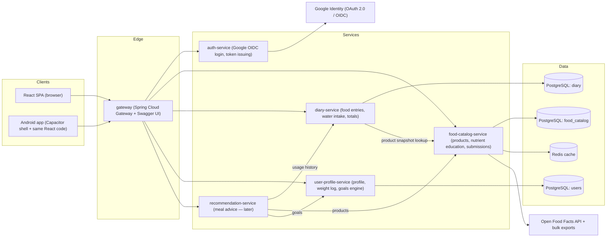

# NutriTrack — Architecture & Design Document

Status: Draft v1.1 (2026-07-21)

Changelog:

- v1.1 — monorepo layout (one folder per service), Docker local / Railway cloud
  deployment, nutrient education content, moderated user food submissions,
  body-weight tracking, water-intake tracking, computed nutrient goals
  (sex/weight based), recommendation service (meal & cooking advice), Swagger
  aggregation at the gateway.
- v1.0 — initial version.

## 1. Overview

NutriTrack is a nutrition-tracking application. A user logs the food they eat by
scanning a product barcode with the camera, typing the barcode (SKU/EAN/UPC)
manually, or searching by product name. For each log entry the user provides the
consumed weight, and the system computes calories, macronutrients (protein,
carbohydrates, fat, fiber, sugars, salt), vitamins, and minerals for that
portion. Beyond food logging the app tracks body weight and water intake,
educates the user about what each nutrient does in the body, derives nutrient
goals from the user's sex and weight, and (eventually) suggests meals and
cooking ideas based on past eating habits and what still fits the day's
nutrient budget.

Key product decisions captured in this document:

| Concern | Decision |
|---|---|
| Repository | Single monorepo; one folder per service/container |
| Backend style | Microservices on Spring Boot (Java 21, Spring Boot 4.x) |
| Food data source | Open Food Facts (open database, ODbL license) |
| User-added foods | Staged in a separate submissions table, moderated before publication |
| Frontend | React (web) packaged with Capacitor for the future Android app |
| Barcode scanning | Client-side camera scanning (ZXing on web, ML Kit on Android) |
| Authentication | Google OAuth 2.0 / OpenID Connect, backend issues/validates JWTs |
| Primary datastore | PostgreSQL (one schema/database per service), Redis for caching |
| Local environment | Docker Compose (all services + PostgreSQL + Redis) |
| Cloud environment | Railway (one Railway service per repo folder, private networking) |
| API documentation | springdoc-openapi per service, aggregated Swagger UI on the gateway |

## 2. Requirements

### 2.1 Functional requirements

- FR-1: Identify a product by scanning its barcode with the device camera.
- FR-2: Identify a product by manually entering its barcode.
- FR-3: Identify a product by free-text name search.
- FR-4: Log a consumption entry: product + weight (grams) + timestamp + meal
  type (breakfast/lunch/dinner/snack).
- FR-5: Compute and display per-entry and per-day totals for calories, all
  available macros, vitamins, and minerals.
- FR-6: Show full nutrition detail available for a product (everything the data
  source provides: nutriments, Nutri-Score, ingredients, allergens).
- FR-7: Sign in with a Google account; all diary data is private per user.
- FR-8: When a product cannot be found, the user can submit their own product
  definition. Submissions are stored in a **separate staging table**, are
  immediately usable by the submitter, and only become visible to other users
  after a moderator approves them.
- FR-9: Show educational content for every tracked nutrient: what it does in
  the body, deficiency symptoms, excess/overdose risks, and common food
  sources.
- FR-10: Track body weight over time (log entries + trend chart).
- FR-11: Track daily water intake (quick-add amounts + daily total vs. target).
- FR-12: Compute default nutrient goals from the user's sex and body weight
  (plus height, age, and activity level where relevant); the user can override
  any target. Goals are offered for recalculation when the logged weight
  changes.
- FR-13 (later phase): Suggest meals and cooking ideas based on the user's
  frequently used products and the nutrient budget remaining for the day.

### 2.2 Non-functional requirements

- NFR-1: Respect Open Food Facts rate limits (15 product reads/min and 10
  searches/min per IP) — requires aggressive caching and a local product mirror.
- NFR-2: Product lookup latency < 300 ms for cached products.
- NFR-3: Stateless backend services; horizontal scalability.
- NFR-4: The same frontend codebase must run in the browser and inside an
  Android WebView shell (Capacitor) without forking the UI code.
- NFR-5: No Google tokens stored server-side beyond what is needed for login;
  diary data protected per-user via JWT subject claims.
- NFR-6: Attribution and share-alike obligations of the ODbL license for Open
  Food Facts data must be met (visible attribution in the UI).
- NFR-7: Every deployable must build from its own repo folder with no reliance
  on files outside that folder (a Railway root-directory constraint, §12.3).
- NFR-8: Nutrient education content must come from reputable public sources
  (NIH Office of Dietary Supplements, EFSA) and carry a "not medical advice"
  disclaimer.

## 3. Repository layout (monorepo)

Everything lives in this repository. Each deployable container has its own
top-level folder under `services/` (or `frontend/`), each with its own
`Dockerfile`, so both Docker Compose and Railway can build any service from its
folder alone:

```text
calorieTracker/
├── docker-compose.yml          # local orchestration: all services + Postgres + Redis
├── docs/                       # architecture & design documents
├── AI/                         # AI working notes
├── scripts/                    # tooling (context7 helper, db seeds, OFF import triggers)
├── services/
│   ├── gateway/                # Spring Cloud Gateway + aggregated Swagger UI
│   │   ├── Dockerfile
│   │   ├── pom.xml
│   │   └── src/...
│   ├── auth-service/           # Google OIDC login, JWT issuing
│   ├── user-profile-service/   # profile, body weight log, goals engine
│   ├── food-catalog-service/   # products, nutrients + education content, submissions
│   ├── diary-service/          # food entries, water intake, daily summaries
│   └── recommendation-service/ # meal & cooking advice (later phase)
└── frontend/                   # React SPA + Capacitor Android shell
    ├── Dockerfile              # nginx static build (used locally; Railway can also serve it)
    └── src/...
```

Build independence (NFR-7): each service is a **standalone Maven project**
(its own `pom.xml`), not modules of one parent POM. Railway's root-directory
deploys pull only the service folder, so services cannot depend on a
`shared-lib` folder elsewhere in the repo. The little code that would be shared
is handled like this:

- **Nutrient codes and education content** are owned by `food-catalog-service`
  and exposed over its API — no shared code needed.
- **JWT resource-server configuration** is a few lines of standard Spring
  Security config per service; duplicated deliberately. If it ever grows, it
  gets published as a versioned internal artifact rather than a source-level
  shared folder.

## 4. High-level architecture



Barcode decoding happens **on the client** (camera frames never leave the
device); the backend only ever receives a decoded barcode string.

## 5. Services

### 5.1 API Gateway (`services/gateway`)

- Spring Cloud Gateway.
- Single public entry point; routes `/api/auth/**`, `/api/products/**`,
  `/api/nutrients/**`, `/api/diary/**`, `/api/users/**`,
  `/api/recommendations/**` to the respective services.
- Validates JWTs (as an OAuth2 resource server) and forwards the verified
  user identity downstream via headers/claims.
- Cross-cutting: CORS, rate limiting per user, request logging.
- **Swagger aggregation**: the gateway hosts one Swagger UI
  (`springdoc-openapi-starter-webflux-ui`) at `/swagger-ui.html` with a
  service selector. Each downstream service exposes its own OpenAPI document
  at `/v3/api-docs` (via `springdoc-openapi`), and the gateway proxies them
  under `/api-docs/{service}`. One URL documents the entire API surface.
  Swagger UI is open in dev; in production it is restricted to authenticated
  admin users (or disabled via config).

### 5.2 Auth service (`services/auth-service`)

- Spring Boot + Spring Security OAuth2 Client.
- Implements **Authorization Code flow with PKCE** against Google (OIDC).
  The SPA/Android app redirects to Google; Google redirects back with a code;
  `auth-service` exchanges the code, verifies the Google ID token, upserts the
  user record (via `user-profile-service`), and issues the application's own
  short-lived **access JWT** plus a rotating **refresh token**.
- Why our own JWTs instead of forwarding Google tokens: decouples session
  lifetime from Google, lets us embed app-specific claims (internal user id,
  **roles** — needed for the moderation workflow), and keeps one validation
  path for all services.
- Token signing: asymmetric (RS256); public keys exposed on a JWKS endpoint so
  the gateway and services can validate without calling `auth-service`.

### 5.3 Food catalog service (`services/food-catalog-service`)

The heart of the system. Owns everything about *products, nutrients, and their
nutrition facts* and hides the upstream data source from the rest of the
system.

Responsibilities:

- **Barcode lookup** (`GET /api/products/barcode/{ean}`):
  1. Check Redis (hot cache, TTL ~24 h).
  2. Check the local PostgreSQL mirror.
  3. On miss, call the Open Food Facts API
     (`GET https://world.openfoodfacts.org/api/v2/product/{barcode}?fields=...`),
     normalize the payload, persist it to the mirror, populate the cache, and
     return it.
- **Name search** (`GET /api/products/search?q=...`): searches the local mirror
  first (PostgreSQL full-text search); falls back to the Open Food Facts search
  API only when local results are insufficient, subject to a client-side rate
  limiter (Resilience4j `RateLimiter` capped safely below the 10 req/min OFF
  search limit).
- **Bulk import job**: Open Food Facts publishes full JSONL/CSV exports. A
  scheduled Spring Batch job periodically imports/refreshes the mirror (either
  the full dump or the daily delta exports) so almost every lookup is served
  locally. This is the primary mechanism for staying within OFF rate limits
  (NFR-1) and hitting latency targets (NFR-2).
- **User product submissions with moderation** (FR-8): submissions do **not**
  go into the `product` table. They are written to a separate
  `product_submission` staging table with status `PENDING`. Workflow:
  1. User submits name, brand, optional barcode, serving size, and nutrition
     facts per 100 g.
  2. The submission is immediately usable **by its submitter only**: search
     and barcode lookup include the caller's own pending submissions, so the
     user can log the food right away without waiting for review.
  3. A moderator (role `MODERATOR`/`ADMIN`) reviews the queue: approve →
     the submission is copied into `product` (with `source = USER_APPROVED`)
     and becomes visible to everyone; reject → status `REJECTED` with a review
     note; the submitter keeps private access either way so their diary never
     breaks.
  4. Duplicate protection: on submission the service checks barcode and fuzzy
     name matches against the catalog and warns the user before accepting.
- **Nutrient reference & education content** (FR-9): owns the `nutrient`
  reference table, extended with educational fields — what the nutrient does
  in the body, deficiency symptoms, excess risks, and common food sources.
  Content is seeded via Flyway from reputable public sources (NIH Office of
  Dietary Supplements fact sheets, EFSA DRV summaries) with source attribution
  per record, and served read-only at `/api/nutrients`. The UI shows a "not
  medical advice" disclaimer with this content (NFR-8).
- **Normalization**: OFF `nutriments` are keyed like `energy-kcal_100g`,
  `proteins_100g`, `vitamin-c_100g`, `calcium_100g`, etc. The service maps them
  into a stable internal model (see §7) so clients and the diary service never
  depend on OFF's naming.

Resilience toward Open Food Facts: Resilience4j circuit breaker + retry +
rate limiter around the OFF client; on OFF outage the service degrades to
mirror-only mode.

### 5.4 Diary service (`services/diary-service`)

- Owns consumption log entries, water intake, and aggregations.
- On entry creation it fetches the product's normalized nutrition facts from
  `food-catalog-service` and stores a **denormalized snapshot** of the
  per-100g values on the entry. Rationale: OFF data is crowdsourced and
  mutable, and user submissions can be edited during review; historical diary
  entries must not silently change.
- Portion math: every stored nutrient value is per 100 g, so
  `amount = value_per_100g × weight_g / 100`. Computed server-side and returned
  with each entry and each daily summary.
- **Water intake** (FR-11): lightweight `water_intake` rows (amount in ml,
  timestamp). The daily summary includes total water vs. the user's water
  target (from `user-profile-service`; default target derived from body
  weight, ~35 ml/kg/day, user-overridable). The UI offers quick-add buttons
  (glass 250 ml, bottle 500 ml, custom).
- Endpoints: create/update/delete food entry, log water, list entries by day,
  daily/weekly summary (totals per nutrient + water), goal progress (goals
  come from `user-profile-service`).
- Exposes an internal endpoint for the recommendation service: most-frequently
  logged products and current-day consumed totals.

### 5.5 User profile service (`services/user-profile-service`)

- Owns the user record (internal id, Google subject id, email, display name,
  avatar, **role**), physical profile (height, age, sex, activity level),
  the **body weight log**, and nutrition goals.
- Upserted by `auth-service` at first login (keyed on the Google `sub` claim).
- **Weight tracking** (FR-10): append-only `body_weight_log` (weight kg,
  measured-at timestamp). The latest entry is the user's current weight;
  history feeds the trends chart.
- **Goals engine** (FR-12): computes default daily targets from the profile:
  - Energy: BMR via Mifflin-St Jeor (needs sex, weight, height, age) × activity
    multiplier, adjusted by the user's objective (lose/maintain/gain).
  - Protein: g per kg body weight (objective-dependent factor).
  - Vitamins & minerals: looked up from a seeded **reference intake table**
    (`nutrient_reference_intake`) keyed by sex and age band, based on
    EFSA/NIH dietary reference values.
  - Water: ~35 ml per kg body weight.
  The engine returns *suggested* targets; the user accepts or overrides each
  one, and overrides are never silently replaced. When a new weight log entry
  changes the inputs, the app offers (not forces) recalculation.

### 5.6 Recommendation service (`services/recommendation-service`) — later phase

Delivers FR-13: "what should I eat/cook now?"

- Inputs, all fetched over internal APIs at request time (no data ownership):
  - the user's most frequently logged products over the last N weeks
    (diary-service),
  - today's consumed totals vs. targets = the **remaining nutrient budget**
    (diary-service + user-profile-service),
  - full nutrition facts for candidate products (food-catalog-service).
- v1 is deliberately **rule-based scoring**, not ML: score candidate products/
  meal templates by how well they fill the largest remaining gaps (e.g. low on
  protein and iron → suggest familiar products rich in those) without
  overshooting calories; prefer products the user already knows. Cooking
  advice starts as curated recipe templates (ingredient lists mapped to
  catalog products) matched by the same gap-filling score.
- Kept as its own service because it is compute-heavy, evolves independently,
  and may later swap the rule engine for a learned model without touching the
  tracking path. Until this phase begins, the folder holds only a stub README;
  no container is deployed.

### 5.7 Service communication

- Clients ↔ gateway: REST/JSON over HTTPS.
- Service ↔ service: synchronous REST with Spring's declarative HTTP interface
  clients. Internal call paths: auth→user (upsert), diary→food (snapshot),
  diary→user (targets), reco→diary/food/user (reads). No message broker until
  an actual async need appears.
- Service discovery: static routing via environment-provided base URLs —
  Docker Compose service names locally, Railway private domains
  (`<service>.railway.internal`, plain `http`) in the cloud. No Eureka needed
  at this scale.

## 6. Food data source: Open Food Facts

Chosen because it is the requirement's "open and reputable source":

- Fully open database (Open Database License, ODbL), ~3M+ products, worldwide
  barcode coverage, crowdsourced but moderated.
- REST API v2: product by barcode
  (`/api/v2/product/{barcode}?fields=product_name,brands,nutriments,nutriscore_data,nutrition_grades,ingredients_text,allergens_tags,serving_size,quantity,image_url`)
  and text search. Read access requires no authentication.
- Provides macros **and** micronutrients (vitamins/minerals) in `nutriments`
  when contributors have entered them, per 100 g and per serving.
- Hard constraints to design around: **15 product reads/min and 10 searches/min
  per IP**; OFF explicitly recommends bulk exports for high-volume use — hence
  the local mirror + Spring Batch import in §5.3.
- Obligations: attribute Open Food Facts in the UI; contribute improvements
  back where feasible (the API also supports writes — approved user
  submissions with barcodes are candidates for contributing back later).

Fallback/secondary source (optional, later): USDA FoodData Central (public
domain, strong on generic/raw foods where OFF is strong on packaged products).
The normalization layer in `food-catalog-service` is the single place a second
source would plug in.

Nutrient education content (FR-9) is sourced separately from the NIH Office of
Dietary Supplements fact sheets and EFSA dietary reference value summaries —
both public, reputable, and citable per nutrient.

## 7. Data model

### 7.1 Food catalog schema (`food_catalog`)

```text
product                                         -- published catalog only
  id                  UUID PK
  barcode             VARCHAR(32) UNIQUE NULL   -- null for products without barcode
  source              ENUM('OFF','USER_APPROVED')
  name                TEXT
  brand               TEXT
  quantity_label      TEXT                      -- e.g. "500 g"
  serving_size_g      NUMERIC NULL
  image_url           TEXT NULL
  nutri_score         CHAR(1) NULL
  ingredients_text    TEXT NULL
  allergen_tags       TEXT[]
  off_last_synced_at  TIMESTAMPTZ NULL
  search_vector       TSVECTOR                  -- full-text index on name+brand

product_nutrient
  product_id          UUID FK -> product
  nutrient_code       VARCHAR(64)
  amount_per_100g     NUMERIC
  unit                VARCHAR(16)               -- g, mg, µg, kcal, kJ
  PRIMARY KEY (product_id, nutrient_code)

product_submission                              -- FR-8: separate staging table
  id                  UUID PK
  submitter_user_id   UUID
  status              ENUM('PENDING','APPROVED','REJECTED')
  barcode             VARCHAR(32) NULL
  name                TEXT
  brand               TEXT NULL
  serving_size_g      NUMERIC NULL
  nutrients           JSONB                     -- {code: {amount_per_100g, unit}}
  submitted_at        TIMESTAMPTZ
  reviewed_by         UUID NULL
  reviewed_at         TIMESTAMPTZ NULL
  review_note         TEXT NULL
  published_product_id UUID NULL FK -> product  -- set on approval

nutrient (reference table, seeded via Flyway)
  code                VARCHAR(64) PK            -- 'energy_kcal','protein','fat','saturated_fat',
                                                -- 'carbohydrates','sugars','fiber','salt','sodium',
                                                -- 'vitamin_a','vitamin_c','vitamin_d','vitamin_b12', ...
                                                -- 'calcium','iron','magnesium','zinc','potassium', ...
  display_name        TEXT
  category            ENUM('ENERGY','MACRO','VITAMIN','MINERAL','OTHER')
  default_unit        VARCHAR(16)
  -- FR-9 education fields:
  description         TEXT                      -- what it is
  body_effects        TEXT                      -- role/effects in the body
  deficiency_effects  TEXT                      -- symptoms/risks when too low
  excess_effects      TEXT                      -- risks when too high
  common_sources      TEXT                      -- typical foods rich in it
  content_source      TEXT                      -- citation (NIH ODS / EFSA URL)

nutrient_reference_intake                       -- FR-12: seeded DRV/RDA table
  nutrient_code       VARCHAR(64) FK -> nutrient
  sex                 ENUM('MALE','FEMALE')
  age_min             SMALLINT                  -- age band, years
  age_max             SMALLINT
  daily_amount        NUMERIC
  unit                VARCHAR(16)
  basis               ENUM('FIXED','PER_KG')    -- PER_KG rows multiply by body weight
  PRIMARY KEY (nutrient_code, sex, age_min)
```

A key-value `product_nutrient` table (rather than one column per nutrient) is
deliberate: OFF exposes dozens of optional micronutrients and the set grows;
this keeps "track all available food data" open-ended without migrations.

`product_submission` is intentionally a separate table (not a status flag on
`product`): the published catalog stays clean for search/joins, submissions can
hold partial or unvalidated data in flexible JSONB, and the moderation queue is
a simple status-filtered scan. Approval **copies** the data into `product`, so
published rows are always fully validated.

### 7.2 Diary schema (`diary`)

```text
diary_entry
  id                  UUID PK
  user_id             UUID       -- from JWT subject
  product_id          UUID NULL  -- published product reference
  submission_id       UUID NULL  -- or the user's own pending submission
  product_name        TEXT       -- snapshot
  weight_g            NUMERIC
  meal_type           ENUM('BREAKFAST','LUNCH','DINNER','SNACK')
  consumed_at         TIMESTAMPTZ
  created_at          TIMESTAMPTZ

diary_entry_nutrient  -- snapshot of per-100g values at logging time
  entry_id            UUID FK -> diary_entry
  nutrient_code       VARCHAR(64)
  amount_per_100g     NUMERIC
  unit                VARCHAR(16)
  PRIMARY KEY (entry_id, nutrient_code)

water_intake          -- FR-11
  id                  UUID PK
  user_id             UUID
  amount_ml           NUMERIC
  logged_at           TIMESTAMPTZ
```

### 7.3 User schema (`users`)

```text
app_user
  id                  UUID PK
  google_sub          VARCHAR(64) UNIQUE
  email               TEXT
  display_name        TEXT
  avatar_url          TEXT NULL
  role                ENUM('USER','MODERATOR','ADMIN') DEFAULT 'USER'
  sex                 ENUM('MALE','FEMALE') NULL      -- for goal computation
  birth_date          DATE NULL
  height_cm           NUMERIC NULL
  activity_level      ENUM('SEDENTARY','LIGHT','MODERATE','ACTIVE','VERY_ACTIVE') NULL
  objective           ENUM('LOSE','MAINTAIN','GAIN') DEFAULT 'MAINTAIN'
  created_at          TIMESTAMPTZ

body_weight_log       -- FR-10, append-only; latest row = current weight
  id                  UUID PK
  user_id             UUID FK -> app_user
  weight_kg           NUMERIC
  measured_at         TIMESTAMPTZ

user_goal
  user_id             UUID FK -> app_user
  nutrient_code       VARCHAR(64)               -- plus pseudo-code 'water_ml'
  daily_target        NUMERIC
  unit                VARCHAR(16)
  origin              ENUM('COMPUTED','USER_OVERRIDE')
  computed_at         TIMESTAMPTZ NULL
  PRIMARY KEY (user_id, nutrient_code)
```

## 8. API design (external, via gateway)

All endpoints require `Authorization: Bearer <access JWT>` except the auth
endpoints. Moderation endpoints additionally require the `MODERATOR` or
`ADMIN` role claim.

```text
POST /api/auth/google/callback      exchange Google auth code -> app JWT + refresh token
POST /api/auth/refresh              rotate refresh token -> new access JWT
POST /api/auth/logout               revoke refresh token

GET  /api/products/barcode/{ean}    product + full normalized nutrition facts
                                    (includes caller's own pending submissions)
GET  /api/products/search?q=&page=  paged name search (idem)
GET  /api/products/{id}

POST /api/products/submissions      submit a new product definition (FR-8)
GET  /api/products/submissions/mine list own submissions + statuses
GET  /api/products/submissions?status=PENDING     [MODERATOR] review queue
POST /api/products/submissions/{id}/approve       [MODERATOR]
POST /api/products/submissions/{id}/reject        [MODERATOR] { note }

GET  /api/nutrients                 all nutrients incl. education content (FR-9)
GET  /api/nutrients/{code}          one nutrient: effects, deficiency, excess, sources

POST /api/diary/entries             { productId | submissionId, weightG, mealType, consumedAt }
GET  /api/diary/entries?date=YYYY-MM-DD
PUT  /api/diary/entries/{id}
DELETE /api/diary/entries/{id}
POST /api/diary/water               { amountMl, loggedAt }         (FR-11)
GET  /api/diary/water?date=
DELETE /api/diary/water/{id}
GET  /api/diary/summary?date=       per-nutrient totals + water vs. targets
GET  /api/diary/summary/range?from=&to=

GET  /api/users/me
PUT  /api/users/me                  profile incl. sex, height, activity, objective
POST /api/users/me/weight           { weightKg, measuredAt }       (FR-10)
GET  /api/users/me/weight?from=&to= weight history for trend chart
GET  /api/users/me/goals            current targets + origin (computed/override)
PUT  /api/users/me/goals            override individual targets
POST /api/users/me/goals/recalculate  recompute suggestions from profile (FR-12)

GET  /api/recommendations/meals?date=   ranked meal/cooking suggestions (FR-13, later)
```

Example diary summary response (truncated):

```json
{
  "date": "2026-07-21",
  "totals": [
    { "code": "energy_kcal", "amount": 1840, "unit": "kcal", "target": 2200 },
    { "code": "protein",     "amount": 92.4, "unit": "g",    "target": 120 },
    { "code": "vitamin_c",   "amount": 63.1, "unit": "mg",   "target": 90 },
    { "code": "calcium",     "amount": 710,  "unit": "mg",   "target": 1000 }
  ],
  "water": { "amountMl": 1500, "targetMl": 2600 }
}
```

## 9. Frontend

### 9.1 Framework choice: React (recommended over Angular)

Both satisfy the requirement; React is recommended because of the Android
constraint:

- **Capacitor** wraps the exact same React build into an Android app, and its
  plugin ecosystem (camera, ML Kit barcode scanning) is first-class.
- If the Android app later needs to be fully native-feeling, **React Native**
  allows reusing the team's React knowledge and most non-UI code (API clients,
  state, domain logic). Angular has no comparable native path.

Stack: React 19 + TypeScript, Vite, TanStack Query (server state/caching),
React Router, a component library (e.g. MUI), Vitest + React Testing Library.

### 9.2 Android strategy

Phase 1: responsive PWA-quality web app.
Phase 2: same codebase wrapped with **Capacitor** → Android APK/AAB.
Native concerns bridged via Capacitor plugins:

- Barcode scanning: `@capacitor-mlkit/barcode-scanning` (Google ML Kit,
  on-device, fast EAN-8/EAN-13/UPC decoding).
- Secure token storage: Capacitor Secure Storage (Android Keystore) instead of
  browser storage.
- Google Sign-In: native Google account picker via Capacitor plugin, feeding
  the same `auth-service` code-exchange endpoint.

### 9.3 Barcode scanning on the web

- Primary: `BarcodeDetector` Web API where available (Chromium/Android).
- Fallback: `@zxing/browser` (ZXing WASM/JS) reading frames from
  `getUserMedia`.
- The UI component abstracts both behind one `useBarcodeScanner()` hook and
  always offers the manual-entry input as a fallback (FR-2).

### 9.4 Main screens

1. **Today / Diary** — daily kcal ring, macro bars, water tracker with
   quick-add buttons (250/500 ml/custom), entries by meal.
2. **Add food** — tabs: Scan | Enter barcode | Search by name; then a portion
   screen (weight in grams, live-computed nutrition preview). A "can't find
   it? add your own" action opens the submission form (FR-8) and explains the
   review process; the user's pending items are labeled "awaiting review" but
   fully loggable.
3. **Product detail** — full nutrition table (macros, vitamins, minerals),
   Nutri-Score, ingredients, allergens, OFF attribution. Every nutrient name
   is tappable → opens the **nutrient education sheet** (FR-9: role in the
   body, deficiency/excess effects, common sources, citation + disclaimer).
4. **Trends** — weekly/monthly charts per nutrient vs. goals; **body weight
   trend** (FR-10) and water intake history (FR-11).
5. **Profile & goals** — Google account info, body stats (sex, height, age,
   activity level, objective), weight log entry, computed vs. overridden
   nutrient targets with a "recalculate suggestions" action (FR-12).
6. **Learn** — browsable nutrient encyclopedia (all FR-9 content, grouped by
   macro/vitamin/mineral).
7. **Moderation queue** (moderators only) — pending submissions with
   approve/reject and duplicate warnings.
8. **Suggestions** (later, FR-13) — "what fits today": ranked meal and cooking
   ideas from familiar products, showing which gaps each suggestion fills.

## 10. Security

- **Login**: OIDC Authorization Code + PKCE with Google. On web the flow runs
  via redirect; on Android via the native account picker / Custom Tabs. In both
  cases the client sends the authorization code to `auth-service`, never
  handling Google client secrets.
- **Sessions**: short-lived access JWT (~15 min) + rotating refresh token.
  Web: refresh token in an HttpOnly Secure SameSite cookie. Android: Keystore-
  backed secure storage.
- **Authorization**: every service is a Spring OAuth2 **resource server**
  validating the app JWT against `auth-service`'s JWKS. User data isolation is
  enforced by always scoping queries to the JWT `sub`-derived user id —
  user ids are never accepted from request bodies.
- **Roles**: the JWT carries a `roles` claim (`USER`, `MODERATOR`, `ADMIN`).
  Moderation endpoints in `food-catalog-service` are guarded by method
  security (`@PreAuthorize("hasRole('MODERATOR')")`); roles are assigned in
  the `app_user` table by an admin.
- **Gateway**: TLS termination, per-user rate limiting, security headers,
  strict CORS (SPA origin + Capacitor origin). Swagger UI restricted outside
  dev environments.
- **Secrets**: environment/secret-manager injected (Railway service variables
  in the cloud, `.env` + Compose locally); never in the repo.

## 11. Cross-cutting concerns

- **Observability**: Spring Boot Actuator + Micrometer; structured JSON logs
  (Railway captures stdout); OpenTelemetry tracing across gateway → services
  (trace id returned in error responses). Prometheus/Grafana optional locally.
- **Resilience**: Resilience4j (circuit breaker, retry, rate limiter) on all
  outbound calls, most importantly the OFF client.
- **Configuration**: per-environment config via environment variables only —
  the same variable names work in Docker Compose and Railway. No Spring Cloud
  Config server.
- **Migrations**: Flyway per service (includes seeding nutrient education
  content and reference intake tables).
- **API contracts**: springdoc-openapi per service, aggregated in the
  gateway's Swagger UI (§5.1); generated TypeScript client for the frontend to
  keep FE/BE types in lockstep.

## 12. Deployment

### 12.1 Container images

Each service folder contains a multi-stage `Dockerfile` (Maven build stage →
JRE 21 runtime stage). The frontend builds to static assets served by nginx
locally; on Railway it can deploy the same way or as a static site.

### 12.2 Local: Docker Compose

One `docker-compose.yml` at the repo root runs the full stack:

- `postgres` (single container, one database per service: `food_catalog`,
  `diary`, `users`), `redis`;
- every Spring service built from its folder (`build: ./services/<name>`);
- `frontend` (nginx) on port 80, `gateway` on 8080;
- inter-service URLs use Compose DNS names (`http://food-catalog-service:8080`),
  configured via the same env var names used on Railway;
- profiles: `docker compose --profile full up` for everything,
  `--profile deps` to run only Postgres/Redis while developing one service in
  the IDE.

### 12.3 Cloud: Railway

One Railway **project**, one Railway **service per repo folder**, all attached
to this GitHub repo:

- **Root directory** per service (e.g. `/services/food-catalog-service`);
  Railway builds each from the `Dockerfile` found in that folder. This is why
  services must be self-contained (NFR-7).
- **Watch paths** per service (e.g. `/services/diary-service/**`) so a push
  only redeploys the services whose folders changed.
- **Databases**: Railway-managed PostgreSQL (one per service, matching the
  schema-per-service model; they can start as one instance with three
  databases on the cheaper plans) and Railway-managed Redis for the catalog
  cache.
- **Private networking**: internal service-to-service traffic uses Railway
  private domains — `http://<service>.railway.internal:<port>` (plain `http`
  inside the private network). Only two services get **public domains**: the
  `gateway` and the `frontend`. All other services are private-network only,
  which enforces the gateway as the single entry point.
- **Environment variables**: managed per Railway service; Railway reference
  variables inject database URLs (`${{Postgres.DATABASE_URL}}`) and internal
  hostnames. Same variable names as Compose.
- **Environments**: Railway environments for `production` and `staging` (PR
  preview environments optional later).
- **OFF bulk import** (§5.3): runs inside `food-catalog-service` as a
  scheduled job; on Railway, disk for the dump download is ephemeral — the
  import streams the JSONL export rather than persisting it. If import memory/
  CPU pressure becomes an issue, split it into a Railway cron service later.

### 12.4 CI/CD

- GitHub Actions per service (path-filtered like Railway watch paths): build +
  unit/integration tests on PR.
- Railway auto-deploys from `main` after merge; staging environment tracks a
  `staging` branch if desired.

## 13. Testing strategy

- **Unit tests** (JUnit 5): portion math, OFF payload normalization (golden
  JSON fixtures from real OFF responses), token issuing/validation, the goals
  engine (Mifflin-St Jeor + reference-intake lookup per sex/age/weight,
  override preservation), submission approval state machine, water target
  derivation.
- **Integration tests**: Testcontainers (PostgreSQL, Redis); WireMock for the
  OFF API (including 404/timeout/rate-limit responses to verify the
  degradation path); Spring Security test support for JWT-protected endpoints
  including role-guarded moderation endpoints (USER must get 403).
- **Contract tests**: OpenAPI-based verification between the frontend client
  and each service (specs are the same documents aggregated in gateway
  Swagger).
- **Frontend**: Vitest + React Testing Library; the barcode hook tested with
  mocked detector implementations; submission form and moderation flows;
  Playwright E2E for scan→log→summary and submit→approve→visible happy paths
  (with a stubbed camera stream).

## 14. Phased roadmap

1. **Phase 1 — Walking skeleton**: repo layout + Docker Compose; gateway with
   Swagger aggregation + auth-service (Google login end to end) +
   user-profile-service; React app with login; first Railway deploy (gateway +
   auth + user + frontend).
2. **Phase 2 — Food lookup**: food-catalog-service with OFF live lookup +
   Redis cache; nutrient reference table incl. education content; product
   detail UI + nutrient education sheets; barcode scanning (web).
3. **Phase 3 — Diary & tracking**: diary-service, portion math, daily summary
   UI; water intake logging; body-weight log; goals engine with computed
   suggestions and overrides.
4. **Phase 4 — Mirror, search & submissions**: Spring Batch OFF bulk import,
   full-text search; user product submissions + moderation queue and roles.
5. **Phase 5 — Android**: Capacitor packaging, ML Kit scanner plugin, native
   Google Sign-In, secure storage, Play Store release.
6. **Phase 6 — Recommendations**: recommendation-service with rule-based meal
   and cooking suggestions from usage history + remaining daily nutrient
   budget; curated recipe templates.

## 15. Open questions / future considerations

- Offline mode on Android (queue diary entries locally, sync later)?
- Recipes/meals composed of multiple products (also feeds Phase 6 cooking
  advice)?
- Contributing approved user submissions back to Open Food Facts (write API)?
- Secondary data source (USDA FDC) for raw/generic foods?
- Household units (pieces, cups) mapped to grams per product?
- Notifications/reminders (water, weigh-in) — needs a push channel on Android.
- Moderation staffing: who gets the MODERATOR role initially (admin-only at
  first)?
