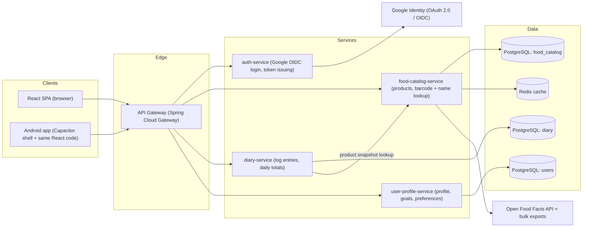

# NutriTrack — Architecture & Design Document

Status: Draft v1.0 (2026-07-21)

## 1. Overview

NutriTrack is a nutrition-tracking application. A user logs the food they eat by
scanning a product barcode with the camera, typing the barcode (SKU/EAN/UPC)
manually, or searching by product name. For each log entry the user provides the
consumed weight, and the system computes calories, macronutrients (protein,
carbohydrates, fat, fiber, sugars, salt), vitamins, and minerals for that
portion.

Key product decisions captured in this document:

| Concern | Decision |
|---|---|
| Backend style | Microservices on Spring Boot (Java 21, Spring Boot 4.x) |
| Food data source | Open Food Facts (open database, ODbL license) |
| Frontend | React (web) packaged with Capacitor for the future Android app |
| Barcode scanning | Client-side camera scanning (ZXing on web, ML Kit on Android) |
| Authentication | Google OAuth 2.0 / OpenID Connect, backend issues/validates JWTs |
| Primary datastore | PostgreSQL (one schema/database per service), Redis for caching |

## 2. Requirements

### 2.1 Functional requirements

- FR-1: Identify a product by scanning its barcode with the device camera.
- FR-2: Identify a product by manually entering its barcode.
- FR-3: Identify a product by free-text name search.
- FR-4: Log a consumption entry: product + weight (grams) + timestamp + meal
  type (breakfast/lunch/dinner/snack).
- FR-5: Compute and display per-entry and per-day totals for calories, all
  available macros, vitamins, and minerals.
- FR-6: Show full nutrition detail available for a product (everything the data
  source provides: nutriments, Nutri-Score, ingredients, allergens).
- FR-7: Sign in with a Google account; all diary data is private per user.
- FR-8: Allow manual/custom products when the barcode is unknown to the data
  source (user-defined nutrition facts).

### 2.2 Non-functional requirements

- NFR-1: Respect Open Food Facts rate limits (15 product reads/min and 10
  searches/min per IP) — requires aggressive caching and a local product mirror.
- NFR-2: Product lookup latency < 300 ms for cached products.
- NFR-3: Stateless backend services; horizontal scalability.
- NFR-4: The same frontend codebase must run in the browser and inside an
  Android WebView shell (Capacitor) without forking the UI code.
- NFR-5: No Google tokens stored server-side beyond what is needed for login;
  diary data protected per-user via JWT subject claims.
- NFR-6: Attribution and share-alike obligations of the ODbL license for Open
  Food Facts data must be met (visible attribution in the UI).

## 3. High-level architecture



Barcode decoding happens **on the client** (camera frames never leave the
device); the backend only ever receives a decoded barcode string.

## 4. Services

### 4.1 API Gateway (`gateway`)

- Spring Cloud Gateway.
- Single public entry point; routes `/api/auth/**`, `/api/products/**`,
  `/api/diary/**`, `/api/users/**` to the respective services.
- Validates JWTs (as an OAuth2 resource server) and forwards the verified
  user identity downstream via headers/claims.
- Cross-cutting: CORS, rate limiting per user, request logging.

### 4.2 Auth service (`auth-service`)

- Spring Boot + Spring Security OAuth2 Client.
- Implements **Authorization Code flow with PKCE** against Google (OIDC).
  The SPA/Android app redirects to Google; Google redirects back with a code;
  `auth-service` exchanges the code, verifies the Google ID token, upserts the
  user record (via `user-profile-service`), and issues the application's own
  short-lived **access JWT** plus a rotating **refresh token**.
- Why our own JWTs instead of forwarding Google tokens: decouples session
  lifetime from Google, lets us embed app-specific claims (internal user id,
  roles), and keeps one validation path for all services.
- Token signing: asymmetric (RS256); public keys exposed on a JWKS endpoint so
  the gateway and services can validate without calling `auth-service`.

### 4.3 Food catalog service (`food-catalog-service`)

The heart of the system. Owns everything about *products and their nutrition
facts* and hides the upstream data source from the rest of the system.

Responsibilities:

- **Barcode lookup** (`GET /api/products/barcode/{ean}`):
  1. Check Redis (hot cache, TTL ~24 h).
  2. Check the local PostgreSQL mirror.
  3. On miss, call the Open Food Facts API
     (`GET https://world.openfoodfacts.org/api/v2/product/{barcode}?fields=...`),
     normalize the payload, persist it to the mirror, populate the cache, and
     return it.
- **Name search** (`GET /api/products/search?q=...`): searches the local mirror
  first (PostgreSQL full-text search); falls back to the Open Food Facts search
  API only when local results are insufficient, subject to a client-side rate
  limiter (Resilience4j `RateLimiter` capped safely below the 10 req/min OFF
  search limit).
- **Bulk import job**: Open Food Facts publishes full JSONL/CSV exports. A
  scheduled Spring Batch job periodically imports/refreshes the mirror (either
  the full dump or the daily delta exports) so almost every lookup is served
  locally. This is the primary mechanism for staying within OFF rate limits
  (NFR-1) and hitting latency targets (NFR-2).
- **Custom products** (FR-8): user-created products live in the same schema,
  flagged with `source = USER` and an `owner_user_id`, visible only to their
  creator.
- **Normalization**: OFF `nutriments` are keyed like `energy-kcal_100g`,
  `proteins_100g`, `vitamin-c_100g`, `calcium_100g`, etc. The service maps them
  into a stable internal model (see §6) so clients and the diary service never
  depend on OFF's naming.

Resilience toward Open Food Facts: Resilience4j circuit breaker + retry +
rate limiter around the OFF client; on OFF outage the service degrades to
mirror-only mode.

### 4.4 Diary service (`diary-service`)

- Owns consumption log entries and aggregations.
- On entry creation it fetches the product's normalized nutrition facts from
  `food-catalog-service` and stores a **denormalized snapshot** of the
  per-100g values on the entry. Rationale: OFF data is crowdsourced and
  mutable; historical diary entries must not silently change when a product is
  re-edited upstream.
- Portion math: every stored nutrient value is per 100 g, so
  `amount = value_per_100g × weight_g / 100`. Computed server-side and returned
  with each entry and each daily summary.
- Endpoints: create/update/delete entry, list entries by day, daily/weekly
  summary (totals per nutrient), goal progress (goals come from
  `user-profile-service`).

### 4.5 User profile service (`user-profile-service`)

- Owns the user record (internal id, Google subject id, email, display name,
  avatar), physical stats (height, weight, age, sex) and nutrition goals
  (daily kcal target, macro split, micronutrient targets).
- Upserted by `auth-service` at first login (keyed on the Google `sub` claim).

### 4.6 Service communication

- Clients ↔ gateway: REST/JSON over HTTPS.
- Service ↔ service: synchronous REST with Spring's declarative HTTP interface
  clients; only two internal call paths exist (auth→user upsert,
  diary→food snapshot), so no message broker is required initially. If async
  needs appear (e.g. recalculating stats, notifications), introduce a broker
  (RabbitMQ/Kafka) then — not before.
- Service discovery: static routing via the gateway + DNS (Docker Compose /
  Kubernetes services). No Eureka needed at this scale.

## 5. Food data source: Open Food Facts

Chosen because it is the requirement's "open and reputable source":

- Fully open database (Open Database License, ODbL), ~3M+ products, worldwide
  barcode coverage, crowdsourced but moderated.
- REST API v2: product by barcode
  (`/api/v2/product/{barcode}?fields=product_name,brands,nutriments,nutriscore_data,nutrition_grades,ingredients_text,allergens_tags,serving_size,quantity,image_url`)
  and text search. Read access requires no authentication.
- Provides macros **and** micronutrients (vitamins/minerals) in `nutriments`
  when contributors have entered them, per 100 g and per serving.
- Hard constraints to design around: **15 product reads/min and 10 searches/min
  per IP**; OFF explicitly recommends bulk exports for high-volume use — hence
  the local mirror + Spring Batch import in §4.3.
- Obligations: attribute Open Food Facts in the UI; contribute improvements
  back where feasible (the API also supports writes, which is a possible later
  feature: letting users photograph and submit missing products).

Fallback/secondary source (optional, later): USDA FoodData Central (public
domain, strong on generic/raw foods where OFF is strong on packaged products).
The normalization layer in `food-catalog-service` is the single place a second
source would plug in.

## 6. Data model

### 6.1 Normalized nutrition model (food_catalog)

```text
product
  id                  UUID PK
  barcode             VARCHAR(32) UNIQUE NULL   -- null for custom products without barcode
  source              ENUM('OFF','USER')
  owner_user_id       UUID NULL                 -- set when source = USER
  name                TEXT
  brand               TEXT
  quantity_label      TEXT                      -- e.g. "500 g"
  serving_size_g      NUMERIC NULL
  image_url           TEXT NULL
  nutri_score         CHAR(1) NULL
  ingredients_text    TEXT NULL
  allergen_tags       TEXT[] 
  off_last_synced_at  TIMESTAMPTZ NULL
  search_vector       TSVECTOR                  -- full-text index on name+brand

product_nutrient
  product_id          UUID FK -> product
  nutrient_code       VARCHAR(64)               -- canonical code, see below
  amount_per_100g     NUMERIC
  unit                VARCHAR(16)               -- g, mg, µg, kcal, kJ
  PRIMARY KEY (product_id, nutrient_code)

nutrient (reference table, seeded)
  code                VARCHAR(64) PK            -- 'energy_kcal','protein','fat','saturated_fat',
                                                -- 'carbohydrates','sugars','fiber','salt','sodium',
                                                -- 'vitamin_a','vitamin_c','vitamin_d','vitamin_b12', ...
                                                -- 'calcium','iron','magnesium','zinc','potassium', ...
  display_name        TEXT
  category            ENUM('ENERGY','MACRO','VITAMIN','MINERAL','OTHER')
  default_unit        VARCHAR(16)
```

A key-value `product_nutrient` table (rather than one column per nutrient) is
deliberate: OFF exposes dozens of optional micronutrients and the set grows;
this keeps "track all available food data" open-ended without migrations.

### 6.2 Diary model (diary)

```text
diary_entry
  id                  UUID PK
  user_id             UUID       -- from JWT subject
  product_id          UUID       -- reference for navigation only
  product_name        TEXT       -- snapshot
  weight_g            NUMERIC
  meal_type           ENUM('BREAKFAST','LUNCH','DINNER','SNACK')
  consumed_at         TIMESTAMPTZ
  created_at          TIMESTAMPTZ

diary_entry_nutrient  -- snapshot of per-100g values at logging time
  entry_id            UUID FK -> diary_entry
  nutrient_code       VARCHAR(64)
  amount_per_100g     NUMERIC
  unit                VARCHAR(16)
  PRIMARY KEY (entry_id, nutrient_code)
```

### 6.3 User model (users)

```text
app_user
  id                  UUID PK
  google_sub          VARCHAR(64) UNIQUE
  email               TEXT
  display_name        TEXT
  avatar_url          TEXT NULL
  created_at          TIMESTAMPTZ

user_goal
  user_id             UUID FK -> app_user
  nutrient_code       VARCHAR(64)
  daily_target        NUMERIC
  unit                VARCHAR(16)
  PRIMARY KEY (user_id, nutrient_code)
```

## 7. API design (external, via gateway)

All endpoints require `Authorization: Bearer <access JWT>` except the auth
endpoints.

```text
POST /api/auth/google/callback      exchange Google auth code -> app JWT + refresh token
POST /api/auth/refresh              rotate refresh token -> new access JWT
POST /api/auth/logout               revoke refresh token

GET  /api/products/barcode/{ean}    product + full normalized nutrition facts
GET  /api/products/search?q=&page=  paged name search
POST /api/products                  create custom product (FR-8)
GET  /api/products/{id}

POST /api/diary/entries             { productId, weightG, mealType, consumedAt }
GET  /api/diary/entries?date=YYYY-MM-DD
PUT  /api/diary/entries/{id}
DELETE /api/diary/entries/{id}
GET  /api/diary/summary?date=       per-nutrient totals for the day + goal progress
GET  /api/diary/summary/range?from=&to=

GET  /api/users/me
PUT  /api/users/me
PUT  /api/users/me/goals
```

Example diary summary response (truncated):

```json
{
  "date": "2026-07-21",
  "totals": [
    { "code": "energy_kcal", "amount": 1840, "unit": "kcal", "target": 2200 },
    { "code": "protein",     "amount": 92.4, "unit": "g",    "target": 120 },
    { "code": "vitamin_c",   "amount": 63.1, "unit": "mg",   "target": 90 },
    { "code": "calcium",     "amount": 710,  "unit": "mg",   "target": 1000 }
  ]
}
```

## 8. Frontend

### 8.1 Framework choice: React (recommended over Angular)

Both satisfy the requirement; React is recommended because of the Android
constraint:

- **Capacitor** wraps the exact same React build into an Android app, and its
  plugin ecosystem (camera, ML Kit barcode scanning) is first-class.
- If the Android app later needs to be fully native-feeling, **React Native**
  allows reusing the team's React knowledge and most non-UI code (API clients,
  state, domain logic). Angular has no comparable native path.

Stack: React 19 + TypeScript, Vite, TanStack Query (server state/caching),
React Router, a component library (e.g. MUI), Vitest + React Testing Library.

### 8.2 Android strategy

Phase 1: responsive PWA-quality web app.
Phase 2: same codebase wrapped with **Capacitor** → Android APK/AAB.
Native concerns bridged via Capacitor plugins:

- Barcode scanning: `@capacitor-mlkit/barcode-scanning` (Google ML Kit,
  on-device, fast EAN-8/EAN-13/UPC decoding).
- Secure token storage: Capacitor Secure Storage (Android Keystore) instead of
  browser storage.
- Google Sign-In: native Google account picker via Capacitor plugin, feeding
  the same `auth-service` code-exchange endpoint.

### 8.3 Barcode scanning on the web

- Primary: `BarcodeDetector` Web API where available (Chromium/Android).
- Fallback: `@zxing/browser` (ZXing WASM/JS) reading frames from
  `getUserMedia`.
- The UI component abstracts both behind one `useBarcodeScanner()` hook and
  always offers the manual-entry input as a fallback (FR-2).

### 8.4 Main screens

1. **Today / Diary** — daily totals ring (kcal), macro bars, entries by meal.
2. **Add food** — tabs: Scan | Enter barcode | Search by name; then a portion
   screen (weight in grams, live-computed nutrition preview).
3. **Product detail** — full nutrition table (macros, vitamins, minerals),
   Nutri-Score, ingredients, allergens, OFF attribution.
4. **Trends** — weekly/monthly charts per nutrient vs. goals.
5. **Profile & goals** — Google account info, body stats, nutrient targets.

## 9. Security

- **Login**: OIDC Authorization Code + PKCE with Google. On web the flow runs
  via redirect; on Android via the native account picker / Custom Tabs. In both
  cases the client sends the authorization code to `auth-service`, never
  handling Google client secrets.
- **Sessions**: short-lived access JWT (~15 min) + rotating refresh token.
  Web: refresh token in an HttpOnly Secure SameSite cookie. Android: Keystore-
  backed secure storage.
- **Authorization**: every service is a Spring OAuth2 **resource server**
  validating the app JWT against `auth-service`'s JWKS. User data isolation is
  enforced by always scoping queries to the JWT `sub`-derived user id —
  user ids are never accepted from request bodies.
- **Gateway**: TLS termination, per-user rate limiting, security headers,
  strict CORS (SPA origin + Capacitor origin).
- **Secrets**: environment/secret-manager injected; never in the repo.

## 10. Cross-cutting concerns

- **Observability**: Spring Boot Actuator + Micrometer; Prometheus metrics,
  Grafana dashboards; structured JSON logs; OpenTelemetry tracing across
  gateway → services (trace id returned in error responses).
- **Resilience**: Resilience4j (circuit breaker, retry, rate limiter) on all
  outbound calls, most importantly the OFF client.
- **Configuration**: per-environment config via environment variables /
  Kubernetes ConfigMaps; no Spring Cloud Config server initially.
- **Migrations**: Flyway per service.
- **API contracts**: springdoc-openapi per service; generated TypeScript client
  for the frontend to keep FE/BE types in lockstep.

## 11. Deployment

- Each service: Docker image (multi-stage build, JRE 21).
- **Local/dev**: Docker Compose (all services + PostgreSQL + Redis).
- **Production**: Kubernetes (one Deployment per service, HPA on CPU/RPS,
  managed PostgreSQL, managed Redis). Gateway behind an ingress/load balancer.
- CI/CD: build + unit/integration tests + image publish per service on merge;
  the mono-repo holds one Maven multi-module project (`gateway`,
  `auth-service`, `food-catalog-service`, `diary-service`,
  `user-profile-service`, `shared-lib` for the nutrient model and JWT config).

## 12. Testing strategy

- **Unit tests** (JUnit 5): portion math, OFF payload normalization (golden
  JSON fixtures from real OFF responses), token issuing/validation.
- **Integration tests**: Testcontainers (PostgreSQL, Redis); WireMock for the
  OFF API (including 404/timeout/rate-limit responses to verify the
  degradation path); Spring Security test support for JWT-protected endpoints.
- **Contract tests**: OpenAPI-based verification between the frontend client
  and each service.
- **Frontend**: Vitest + React Testing Library; the barcode hook tested with
  mocked detector implementations; Playwright E2E for the scan→log→summary
  happy path (with a stubbed camera stream).

## 13. Phased roadmap

1. **Phase 1 — Walking skeleton**: gateway + auth-service (Google login end to
   end) + user-profile-service; React app with login.
2. **Phase 2 — Food lookup**: food-catalog-service with OFF live lookup +
   Redis cache; product detail UI; barcode scanning (web).
3. **Phase 3 — Diary**: diary-service, portion math, daily summary UI, goals.
4. **Phase 4 — Mirror & scale**: Spring Batch OFF bulk import, full-text
   search, custom products.
5. **Phase 5 — Android**: Capacitor packaging, ML Kit scanner plugin, native
   Google Sign-In, secure storage, Play Store release.

## 14. Open questions / future considerations

- Offline mode on Android (queue diary entries locally, sync later)?
- Recipes/meals composed of multiple products?
- Contributing missing products back to Open Food Facts (write API)?
- Secondary data source (USDA FDC) for raw/generic foods?
- Household units (pieces, cups) mapped to grams per product?
